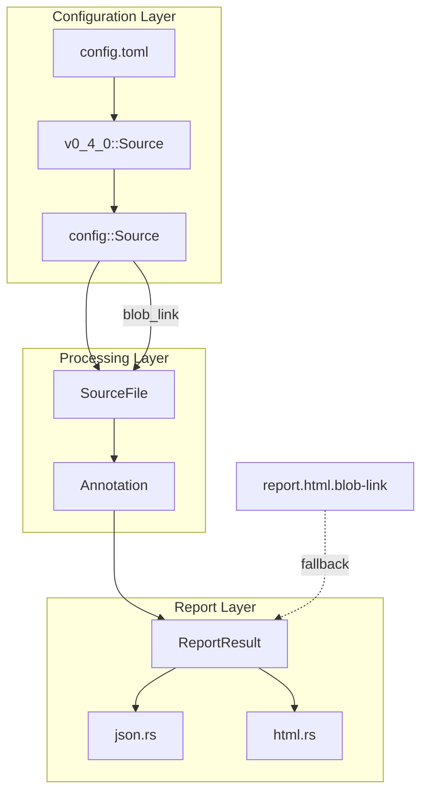
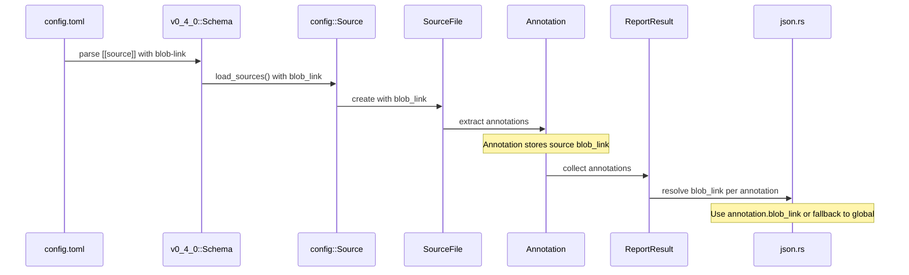

# Design Document: Source Blob Link

## Overview

This feature extends Duvet's `[[source]]` configuration blocks to accept an optional `blob-link` field, enabling per-source blob link configuration. This is foundational for multi-package report merging, where different source files may reside in different repositories or paths and require distinct blob links for correct HTML report generation.

Currently, `blob_link` is a single global setting in `report.html.blob-link`. With this change, each source pattern can optionally override the global blob link, and annotations will inherit the blob link from their matching source configuration.

## Architecture



## Sequence Diagram: Blob Link Resolution



## Components and Interfaces

### Component 1: Config Schema (v0_4_0.rs)

**Purpose**: Parse the TOML configuration and deserialize the optional `blob-link` field on source blocks.

**Interface**:
```rust
#[derive(Clone, Debug, Deserialize)]
#[serde(deny_unknown_fields)]
#[cfg_attr(test, derive(schemars::JsonSchema))]
pub struct Source {
    pub pattern: String,
    #[serde(default, rename = "comment-style")]
    pub comment_style: CommentStyle,
    #[serde(rename = "type", default)]
    pub default_type: DefaultType,
    #[serde(default, rename = "blob-link")]
    pub blob_link: Option<TemplatedString>,  // NEW
}
```

**Responsibilities**:
- Deserialize `blob-link` field from TOML source blocks
- Support templated strings (same as `report.html.blob-link`)
- Generate JSON schema for config validation

### Component 2: Internal Config (config.rs)

**Purpose**: Store the resolved blob link in the internal Source struct for use during annotation processing.

**Interface**:
```rust
#[derive(Clone, Debug)]
pub struct Source {
    pub pattern: String,
    pub root: Path,
    pub comment_style: crate::comment::Pattern,
    pub default_type: crate::annotation::AnnotationType,
    pub blob_link: Option<Arc<str>>,  // NEW
}
```

**Responsibilities**:
- Store resolved blob link from schema
- Propagate blob link to source file processing

### Component 3: SourceFile (source.rs)

**Purpose**: Carry the blob link through to annotation extraction.

**Interface**:
```rust
#[derive(Clone, Debug, PartialEq, PartialOrd, Ord, Eq, Hash)]
pub enum SourceFile {
    Text {
        pattern: comment::Pattern,
        default_type: AnnotationType,
        path: Path,
        blob_link: Option<Arc<str>>,  // NEW
    },
    Toml(Path),
}
```

**Responsibilities**:
- Store blob link for text-based source files
- Pass blob link to annotation extraction

### Component 4: Annotation (annotation.rs)

**Purpose**: Store the blob link on each annotation for use in report generation.

**Interface**:
```rust
#[derive(Debug, PartialEq, PartialOrd, Eq, Ord, Hash)]
pub struct Annotation {
    // ... existing fields ...
    pub blob_link: Option<Arc<str>>,  // NEW
}
```

**Responsibilities**:
- Store the blob link inherited from the source configuration
- Provide blob link for report generation

### Component 5: Report Generation (json.rs)

**Purpose**: Include per-annotation blob links in the JSON output for the frontend to consume.

**Interface**:
```rust
// In the annotation serialization loop:
if let Some(blob_link) = annotation.resolve_blob_link(report.blob_link) {
    kv!(obj, s!("blob_link"), s!(blob_link));
}
```

**Responsibilities**:
- Serialize `blob_link` field for each annotation in JSON output
- Resolve blob link with fallback logic (annotation-level → global)
- Maintain backward compatibility (omit field if no blob link)

### Component 6: React Frontend (result.js)

**Purpose**: Use per-annotation blob links when generating source file links in the HTML report.

**Interface**:
```javascript
// Updated createBlobLinker to accept per-annotation blob_link
function createBlobLinker(global_blob_link) {
  global_blob_link = (global_blob_link || "").replace(/\/+$/, "");

  return (anno) => {
    if (!anno.source) return null;

    // Use annotation's blob_link if present, otherwise fall back to global
    const blob_link = (anno.blob_link || global_blob_link || "").replace(/\/+$/, "");

    let link = anno.source;
    if (anno.line > 0) {
      link += `#L${anno.line}`;
    }

    return {
      title: link,
      href: blob_link.length ? `${blob_link}/${link}` : null,
      toString() { return link; },
    };
  };
}
```

**Responsibilities**:
- Check for per-annotation `blob_link` field first
- Fall back to global `blob_link` if annotation doesn't have one
- Generate correct source file URLs for each annotation

## Data Models

### Model 1: Source Configuration (TOML)

```toml
[[source]]
pattern = "src/**/*.rs"
blob-link = "https://github.com/org/my-package/blob/main"  # optional
comment-style = { meta = "//=", content = "//#" }
type = "implementation"
```

**Validation Rules**:
- `blob-link` is optional
- If present, must be a valid URL string (templated string format)
- Pattern must be a valid glob pattern

### Model 2: Blob Link Resolution

```rust
/// Resolution priority for blob links:
/// 1. Source-level blob_link (if set)
/// 2. Global report.html.blob-link (if set)
/// 3. None (no blob link)
fn resolve_blob_link(
    annotation_blob_link: Option<&str>,
    global_blob_link: Option<&str>,
) -> Option<&str> {
    annotation_blob_link.or(global_blob_link)
}
```

## Key Functions with Formal Specifications

### Function 1: load_sources()

```rust
impl Schema {
    pub fn load_sources(&self, sources: &mut Vec<config::Source>, root: &Path) -> Result {
        for source in self.sources.iter() {
            sources.push(config::Source {
                pattern: source.pattern.parse().into_diagnostic()?,
                comment_style: (&source.comment_style).into(),
                default_type: source.default_type.into(),
                root: root.clone(),
                blob_link: source.blob_link.as_ref().map(From::from),  // NEW
            });
        }
        Ok(())
    }
}
```

**Preconditions:**
- `self.sources` contains valid source configurations
- `root` is a valid path

**Postconditions:**
- Each source in `sources` has `blob_link` set if the schema source had `blob-link`
- `blob_link` is `None` if not specified in config

### Function 2: SourceFile::new_text()

```rust
impl SourceFile {
    pub fn new_text(
        pattern: comment::Pattern,
        default_type: AnnotationType,
        path: Path,
        blob_link: Option<Arc<str>>,
    ) -> Self {
        Self::Text {
            pattern,
            default_type,
            path,
            blob_link,
        }
    }
}
```

**Preconditions:**
- `path` is a valid file path
- `pattern` is a valid comment pattern

**Postconditions:**
- Returns `SourceFile::Text` variant with all fields set
- `blob_link` is preserved from input

### Function 3: createBlobLinker() (JavaScript)

```javascript
function createBlobLinker(global_blob_link) {
  global_blob_link = (global_blob_link || "").replace(/\/+$/, "");

  return (anno) => {
    if (!anno.source) return null;

    // Per-annotation blob_link takes precedence over global
    const blob_link = (anno.blob_link || global_blob_link || "").replace(/\/+$/, "");

    let link = anno.source;
    if (anno.line > 0) link += `#L${anno.line}`;
    if (anno.line > 0 && anno.line_impl > 0) link += `-L${anno.line_impl}`;

    return {
      title: link,
      href: blob_link.length ? `${blob_link}/${link}` : null,
      toString() { return link; },
    };
  };
}
```

**Preconditions:**
- `global_blob_link` may be null/undefined or a string
- `anno` is a valid annotation object

**Postconditions:**
- Returns object with `title`, `href`, and `toString()`
- `href` uses `anno.blob_link` if present, otherwise `global_blob_link`
- `href` is `null` if no blob link is available

## Example Usage

### Configuration Example

```toml
# .duvet/config.toml
'$schema' = "https://awslabs.github.io/duvet/config/v0.4.0.json"

# Global fallback blob link
[report.html]
blob-link = "https://github.com/org/main-repo/blob/main"

# Source with custom blob link (overrides global)
[[source]]
pattern = "crates/package-a/src/**/*.rs"
blob-link = "https://github.com/org/package-a/blob/main"

# Source without blob link (uses global fallback)
[[source]]
pattern = "crates/package-b/src/**/*.rs"
```

### Code Example

```rust
// In report generation
for annotation in report.annotations.iter() {
    let blob_link = annotation.resolve_blob_link(report.blob_link);
    if let Some(link) = blob_link {
        // Generate link: {blob_link}/{source_path}#L{line}
        let url = format!("{}/{}", link, annotation.source.display());
    }
}
```

## Correctness Properties

*A property is a characteristic or behavior that should hold true across all valid executions of a system-essentially, a formal statement about what the system should do. Properties serve as the bridge between human-readable specifications and machine-verifiable correctness guarantees.*

### Property 1: Config Round-Trip Preservation

*For any* valid `blob-link` value in a `[[source]]` configuration block, the value is preserved through schema parsing → internal config loading → annotation creation, resulting in the annotation having the exact same blob link value.

**Validates: Requirements 1.1, 2.1, 3.1, 3.2**

### Property 2: Fallback Resolution

*For any* annotation without a `blob_link` value, when resolving the blob link for report generation, the system returns the global `report.html.blob-link` value if set, otherwise returns None.

**Validates: Requirements 4.3, 6.2**

### Property 3: JSON Serialization Consistency

*For any* annotation with a `blob_link` value, the JSON report output includes a `blob_link` field in the annotation object with the exact same value.

**Validates: Requirements 5.1**

### Property 4: Frontend Blob Link Resolution

*For any* annotation in the JSON output, the frontend's `createBlobLinker` function generates an `href` using the annotation's `blob_link` field if present, otherwise using the global `blob_link`, and returns `null` if neither is available.

**Validates: Requirements 6.1, 6.2, 6.3**

### Property 5: Backward Compatibility

*For any* valid existing configuration file (without `blob-link` on source blocks), the system parses successfully and all annotations use the global `report.html.blob-link` for their resolved blob link.

**Validates: Requirements 8.1, 8.2**

### Property 6: JSON Schema Validity

*For any* configuration file with `blob-link` fields on source blocks, validation against the generated JSON schema succeeds when the values are valid templated strings.

**Validates: Requirements 1.3, 7.1, 7.2**

## Error Handling

### Error Scenario 1: Invalid Blob Link URL

**Condition**: User provides malformed URL in `blob-link`
**Response**: Templated string parsing handles this; no additional validation needed at this layer
**Recovery**: User corrects the URL in config

### Error Scenario 2: Missing Source Pattern

**Condition**: Source block has `blob-link` but no `pattern`
**Response**: Existing schema validation rejects (pattern is required)
**Recovery**: User adds required `pattern` field

## Testing Strategy

### Unit Testing Approach

- Test `load_sources()` with and without `blob-link` field
- Test `resolve_blob_link()` with all combinations of annotation/global blob links
- Test JSON schema generation includes `blob-link` property

### Property-Based Testing Approach

**Property Test Configuration**:
- Minimum 100 iterations per property test
- Each property test tagged with: **Feature: source-blob-link, Property {number}: {property_text}**
- Property tests validate universal correctness across generated inputs

**Property Test Library**: bolero (already used in the project)

### Integration Testing Approach

- Add integration test config with per-source blob links
- Verify JSON output contains correct blob links per annotation
- Verify HTML report generates correct source links
- Test frontend renders correct links for annotations with different blob links

## Dependencies

- `serde` - Deserialization of config
- `schemars` - JSON schema generation (test only)
- `duvet-core` - Path handling, diagnostics
- React frontend (`duvet/www`) - HTML report rendering
