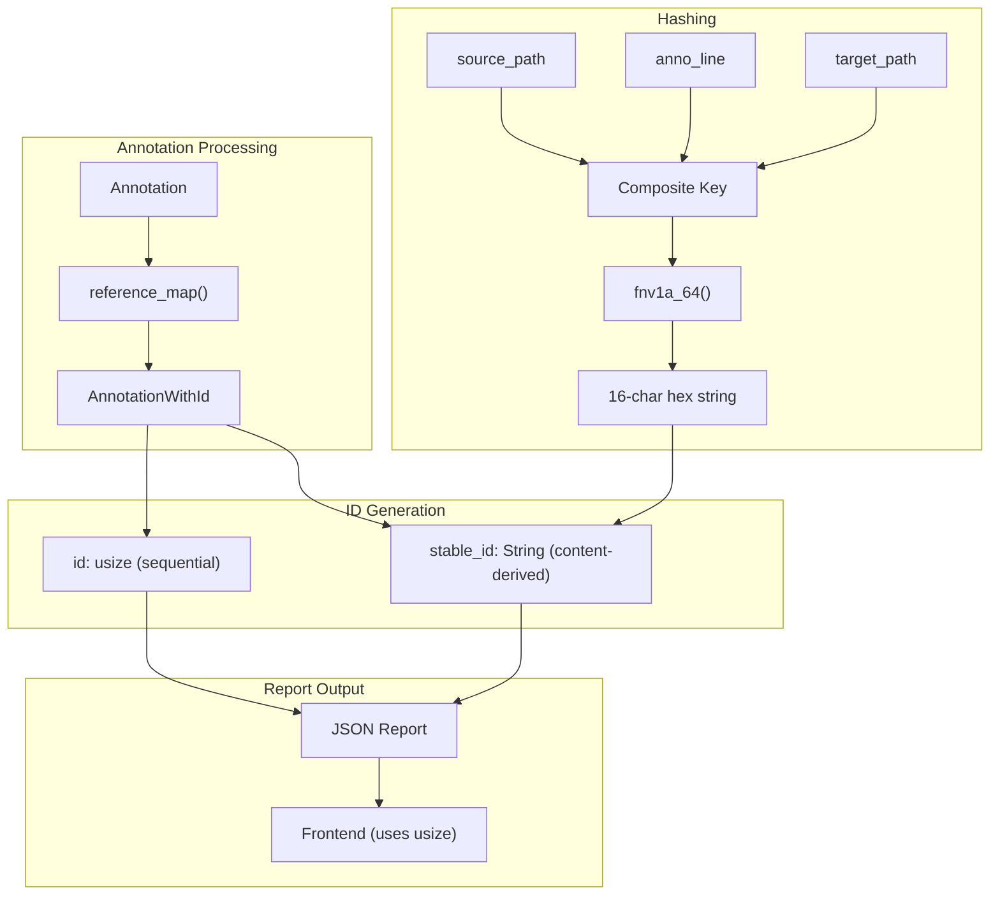
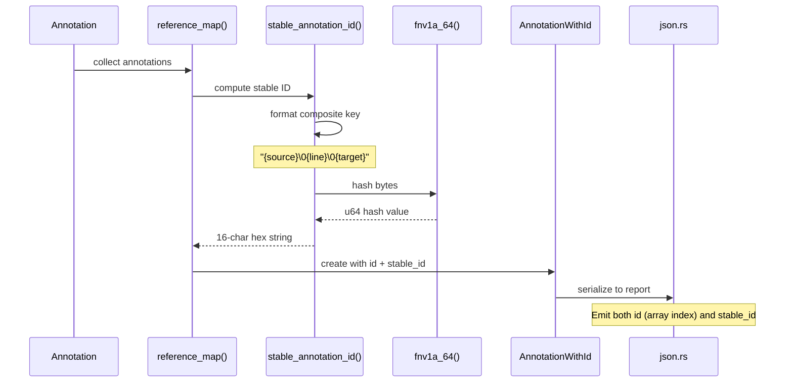

# Design Document: Stable Annotation Identifiers

## Overview

This feature replaces sequential `usize` annotation IDs with content-based deterministic IDs. Currently, annotation IDs are assigned sequentially during `reference_map()`, which causes collisions when merging reports from multiple packages. The new stable IDs are derived from a composite key of `(source_path, anno_line, target_path)` using FNV-1a hashing, producing a 16-character hex string.

This is Phase 1.2 of the multi-package merge plan. The phase-in strategy adds `stable_id` as inert metadata to v1 JSON output without breaking compatibility—the frontend continues using integer indices while we validate determinism and check for collisions against real spec corpora before promoting stable IDs to primary keys in v2.

## Architecture



## Sequence Diagram: Stable ID Generation



## Components and Interfaces

### Component 1: Stable ID Generator (annotation.rs)

**Purpose**: Generate deterministic content-based IDs for annotations using FNV-1a hashing.

**Interface**:
```rust
/// Generates a stable, deterministic ID for an annotation based on its content.
/// 
/// The ID is derived from a composite key of (source_path, anno_line, target_path)
/// using FNV-1a 64-bit hashing, formatted as a 16-character hex string.
pub fn stable_annotation_id(annotation: &Annotation) -> String {
    let mut buf = Vec::new();
    let _ = write!(buf, "{}\0{}\0{}",
        annotation.source.to_string_lossy(),
        annotation.anno_line,
        annotation.target_path(),
    );
    format!("{:016x}", fnv1a_64(&buf))
}

/// FNV-1a 64-bit hash function.
/// Deterministic, no dependencies, sufficient for expected annotation counts.
fn fnv1a_64(data: &[u8]) -> u64 {
    const FNV_OFFSET_BASIS: u64 = 0xcbf29ce484222325;
    const FNV_PRIME: u64 = 0x100000001b3;
    
    let mut hash = FNV_OFFSET_BASIS;
    for &byte in data {
        hash ^= byte as u64;
        hash = hash.wrapping_mul(FNV_PRIME);
    }
    hash
}
```

**Responsibilities**:
- Generate deterministic IDs from annotation content
- Ensure same annotation produces same ID across independent runs
- Produce 16-character hex strings suitable for use as keys

### Component 2: AnnotationWithId (annotation.rs)

**Purpose**: Store both sequential and stable IDs for each annotation during the phase-in period.

**Interface**:
```rust
#[derive(Clone, Debug, PartialEq, PartialOrd, Eq, Ord, Hash)]
pub struct AnnotationWithId {
    pub id: usize,              // Sequential ID for v1 compatibility
    pub stable_id: String,      // Content-derived ID for v2/merge
    pub annotation: Arc<Annotation>,
}
```

**Responsibilities**:
- Maintain backward compatibility with sequential IDs
- Store stable IDs for future v2 format and merge operations
- Provide access to underlying annotation data

### Component 3: Reference Map Builder (annotation.rs)

**Purpose**: Build the annotation reference map with both ID types computed.

**Interface**:
```rust
pub async fn reference_map(set: AnnotationSet) -> Result<AnnotationReferenceMap> {
    let mut map = HashMap::new();
    for (id, anno) in set.iter().enumerate() {
        let target = anno.target()?;
        let section = anno.target_section();
        let stable_id = stable_annotation_id(&anno);
        let entry: &mut Vec<_> = map.entry((target, section)).or_default();
        entry.push(AnnotationWithId {
            id,
            stable_id,
            annotation: anno.clone(),
        });
    }
    let map = map
        .into_iter()
        .map(|(key, value)| (key, value.into()))
        .collect();
    Ok(Arc::new(map))
}
```

**Responsibilities**:
- Compute stable IDs during reference map construction
- Maintain sequential ID assignment for v1 compatibility
- Group annotations by target and section

### Component 4: JSON Report Generator (json.rs)

**Purpose**: Emit stable_id as inert metadata in v1 JSON output.

**Interface**:
```rust
// In annotation serialization loop:
kv!(obj, s!("source"), s!(annotation.source.to_string_lossy()));
kv!(obj, s!("stable_id"), s!(stable_id));  // NEW: inert metadata
kv!(obj, s!("target_path"), s!(annotation.resolve_target_path()));
// ... rest of annotation fields
```

**Responsibilities**:
- Serialize `stable_id` field for each annotation
- Maintain v1 format compatibility (frontend ignores unknown fields)
- Enable validation of determinism before v2 migration

## Data Models

### Model 1: Composite Key

```rust
/// The composite key used to generate stable annotation IDs.
/// 
/// Fields included:
/// - source_path: Path to the source file containing the annotation
/// - anno_line: Line number where the annotation starts
/// - target_path: The specification path being referenced
/// 
/// Fields deliberately excluded:
/// - target_section: Redundant given (source, line) uniqueness
/// - anno_type: Redundant given (source, line) uniqueness
/// - quote: Can be long; not needed for uniqueness
/// - quote_hash: Redundant given (source, line) uniqueness
struct CompositeKey {
    source_path: String,  // annotation.source.to_string_lossy()
    anno_line: usize,     // annotation.anno_line
    target_path: String,  // annotation.target_path()
}

// Serialized format: "{source_path}\0{anno_line}\0{target_path}"
// The null byte separator ensures unambiguous parsing
```

**Validation Rules**:
- `source_path` must be non-empty (annotations always have a source)
- `anno_line` is always set (0 if not specified in source)
- `target_path` must be non-empty (annotations always have a target)

### Model 2: Stable ID Format

```rust
/// A stable annotation ID is a 16-character lowercase hex string.
/// 
/// Example: "a3f7b2c1e9d04856"
/// 
/// Properties:
/// - Always exactly 16 characters (64-bit hash formatted with leading zeros)
/// - Lowercase hexadecimal [0-9a-f]
/// - Deterministic: same input always produces same output
/// - Collision-resistant: 64 bits sufficient for expected annotation counts
type StableId = String;

// Validation regex: ^[0-9a-f]{16}$
```

## Key Functions with Formal Specifications

### Function 1: fnv1a_64()

```rust
fn fnv1a_64(data: &[u8]) -> u64 {
    const FNV_OFFSET_BASIS: u64 = 0xcbf29ce484222325;
    const FNV_PRIME: u64 = 0x100000001b3;
    
    let mut hash = FNV_OFFSET_BASIS;
    for &byte in data {
        hash ^= byte as u64;
        hash = hash.wrapping_mul(FNV_PRIME);
    }
    hash
}
```

**Preconditions:**
- `data` is a valid byte slice (may be empty)

**Postconditions:**
- Returns a 64-bit unsigned integer
- For any given input, always returns the same output (deterministic)
- Empty input returns FNV_OFFSET_BASIS (0xcbf29ce484222325)

**Loop Invariants:**
- `hash` is always a valid u64 value
- Each iteration processes exactly one byte

### Function 2: stable_annotation_id()

```rust
pub fn stable_annotation_id(annotation: &Annotation) -> String {
    let mut buf = Vec::new();
    let _ = write!(buf, "{}\0{}\0{}",
        annotation.source.to_string_lossy(),
        annotation.anno_line,
        annotation.target_path(),
    );
    format!("{:016x}", fnv1a_64(&buf))
}
```

**Preconditions:**
- `annotation` is a valid Annotation reference
- `annotation.source` is a valid Path
- `annotation.target` is a non-empty string

**Postconditions:**
- Returns a 16-character lowercase hex string
- Same annotation always produces same ID (deterministic)
- Different annotations with same (source, line, target) produce same ID
- Different annotations with different (source, line, target) produce different IDs (with high probability)

**Loop Invariants:** N/A (no loops in this function)

### Function 3: reference_map() (updated)

```rust
pub async fn reference_map(set: AnnotationSet) -> Result<AnnotationReferenceMap> {
    let mut map = HashMap::new();
    for (id, anno) in set.iter().enumerate() {
        let target = anno.target()?;
        let section = anno.target_section();
        let stable_id = stable_annotation_id(&anno);
        let entry: &mut Vec<_> = map.entry((target, section)).or_default();
        entry.push(AnnotationWithId {
            id,
            stable_id,
            annotation: anno.clone(),
        });
    }
    let map = map
        .into_iter()
        .map(|(key, value)| (key, value.into()))
        .collect();
    Ok(Arc::new(map))
}
```

**Preconditions:**
- `set` is a valid AnnotationSet (BTreeSet ensures sorted order)
- All annotations in set have valid targets

**Postconditions:**
- Returns a map grouping annotations by (target, section)
- Each AnnotationWithId has both `id` (sequential) and `stable_id` (content-derived)
- Sequential IDs are assigned in iteration order (deterministic due to BTreeSet)
- Stable IDs are computed from annotation content

**Loop Invariants:**
- `id` increments by 1 each iteration
- All processed annotations have valid stable_ids

## Algorithmic Pseudocode

### Main Algorithm: Stable ID Generation

```pascal
ALGORITHM stable_annotation_id(annotation)
INPUT: annotation of type Annotation
OUTPUT: stable_id of type String (16-char hex)

BEGIN
  ASSERT annotation.source IS NOT NULL
  ASSERT annotation.target IS NOT EMPTY
  
  // Step 1: Build composite key with null separators
  composite_key ← CONCAT(
    annotation.source.to_string_lossy(),
    "\0",
    annotation.anno_line.to_string(),
    "\0",
    annotation.target_path()
  )
  
  // Step 2: Hash the composite key
  hash_value ← fnv1a_64(composite_key.as_bytes())
  
  // Step 3: Format as 16-char hex with leading zeros
  stable_id ← FORMAT("{:016x}", hash_value)
  
  ASSERT LENGTH(stable_id) = 16
  ASSERT stable_id MATCHES /^[0-9a-f]{16}$/
  
  RETURN stable_id
END
```

**Preconditions:**
- annotation is a valid Annotation with source and target

**Postconditions:**
- Returns exactly 16 lowercase hex characters
- Same annotation always produces same stable_id

### FNV-1a Hash Algorithm

```pascal
ALGORITHM fnv1a_64(data)
INPUT: data of type byte array
OUTPUT: hash of type u64

CONSTANTS:
  FNV_OFFSET_BASIS ← 0xcbf29ce484222325
  FNV_PRIME ← 0x100000001b3

BEGIN
  hash ← FNV_OFFSET_BASIS
  
  FOR each byte IN data DO
    ASSERT hash IS VALID u64
    
    // XOR with byte
    hash ← hash XOR byte
    
    // Multiply by prime (with wrapping)
    hash ← hash WRAPPING_MUL FNV_PRIME
  END FOR
  
  RETURN hash
END
```

**Preconditions:**
- data is a valid byte array (may be empty)

**Postconditions:**
- Returns a 64-bit unsigned integer
- Deterministic: same input always produces same output

**Loop Invariants:**
- hash is always a valid u64 value
- All bytes before current index have been processed

## Example Usage

### Computing Stable IDs

```rust
// Example 1: Basic stable ID generation
let annotation = Annotation {
    source: Path::from("src/lib.rs"),
    anno_line: 42,
    target: "https://www.rfc-editor.org/rfc/rfc9000#section-2.1".to_string(),
    // ... other fields
};

let stable_id = stable_annotation_id(&annotation);
// stable_id = "a3f7b2c1e9d04856" (example)

// Example 2: Same annotation always produces same ID
let stable_id_2 = stable_annotation_id(&annotation);
assert_eq!(stable_id, stable_id_2);

// Example 3: Different line produces different ID
let annotation_2 = Annotation {
    source: Path::from("src/lib.rs"),
    anno_line: 43,  // Different line
    target: "https://www.rfc-editor.org/rfc/rfc9000#section-2.1".to_string(),
    // ... other fields
};
let stable_id_3 = stable_annotation_id(&annotation_2);
assert_ne!(stable_id, stable_id_3);
```

### JSON Output with Stable ID

```json
{
  "annotations": [
    {
      "source": "src/lib.rs",
      "stable_id": "a3f7b2c1e9d04856",
      "target_path": "https://www.rfc-editor.org/rfc/rfc9000",
      "target_section": "section-2.1",
      "line": 42,
      "type": "CITATION"
    }
  ],
  "statuses": {
    "0": {
      "spec": 65,
      "incomplete": 0,
      "citation": 65,
      "related": [1, 2]
    }
  }
}
```

### Reference Map Construction

```rust
// Building reference map with stable IDs
let annotations: AnnotationSet = /* ... */;
let reference_map = reference_map(annotations).await?;

// Each AnnotationWithId now has both IDs
for (key, annotations) in reference_map.iter() {
    for anno_with_id in annotations.iter() {
        println!("Sequential ID: {}", anno_with_id.id);
        println!("Stable ID: {}", anno_with_id.stable_id);
    }
}
```

## Correctness Properties

*A property is a characteristic or behavior that should hold true across all valid executions of a system-essentially, a formal statement about what the system should do. Properties serve as the bridge between human-readable specifications and machine-verifiable correctness guarantees.*

### Property 1: Hash Determinism

*For any* byte slice input, calling `fnv1a_64()` multiple times with the same input always produces the same 64-bit output, and *for any* annotation, calling `stable_annotation_id()` multiple times always produces the same 16-character hex string.

**Validates: Requirements 1.2, 2.2, 9.2**

### Property 2: Stable ID Format

*For any* annotation, the generated stable ID is exactly 16 characters long and contains only lowercase hexadecimal characters (matching regex `^[0-9a-f]{16}$`).

**Validates: Requirements 2.1, 7.1, 7.2, 7.3, 7.4**

### Property 3: Cross-Run Determinism

*For any* annotation set, processing it through `reference_map()` multiple times (or in independent runs) produces identical `stable_id` values for each annotation, given the same source content.

**Validates: Requirements 2.5, 5.4, 6.4, 9.1, 9.3**

### Property 4: Collision Resistance

*For any* two annotations with different composite keys (different source_path, anno_line, or target_path), their stable IDs are different with overwhelming probability.

**Validates: Requirements 2.6**

### Property 5: Sequential ID Preservation

*For any* annotation set processed through `reference_map()`, the sequential `id` field is assigned in enumeration order (0, 1, 2, ...) matching the BTreeSet iteration order.

**Validates: Requirements 4.3, 5.3, 8.2, 8.3**

### Property 6: JSON Output Completeness

*For any* annotation serialized to JSON, the output includes a `stable_id` field containing the 16-character hex ID, while preserving all existing v1 fields.

**Validates: Requirements 6.1, 6.2, 6.3**

## Error Handling

### Error Scenario 1: Invalid Annotation Source

**Condition**: Annotation has an invalid or empty source path
**Response**: `to_string_lossy()` handles invalid UTF-8 gracefully, replacing invalid sequences
**Recovery**: No recovery needed; hash is still computed deterministically

### Error Scenario 2: Hash Collision

**Condition**: Two different annotations produce the same stable ID
**Response**: Extremely unlikely (2^-64 probability); if detected, log warning
**Recovery**: For v1, collisions don't affect functionality (sequential IDs still used). For v2, would need to extend key or use different hash.

### Error Scenario 3: Empty Target Path

**Condition**: Annotation has empty target path
**Response**: Hash is still computed (empty string is valid input)
**Recovery**: Validation should catch this earlier in annotation parsing

## Testing Strategy

### Unit Testing Approach

- Test `fnv1a_64()` with known test vectors from FNV specification
- Test `stable_annotation_id()` with various annotation configurations
- Test that same annotation produces same ID
- Test that different annotations produce different IDs
- Test ID format validation (16 hex chars)

### Property-Based Testing Approach

**Property Test Configuration**:
- Minimum 100 iterations per property test
- Each property test tagged with: **Feature: stable-annotation-ids, Property {number}: {property_text}**
- Property tests validate universal correctness across generated inputs

**Property Test Library**: bolero (already used in the project)

### Integration Testing Approach

- Add integration test that generates report twice and compares stable IDs
- Verify JSON output includes `stable_id` field
- Verify frontend continues to work (ignores `stable_id`)
- Test with real spec corpora to check for collisions

## Performance Considerations

- FNV-1a is extremely fast (simple XOR and multiply per byte)
- Composite key construction allocates a small Vec (~100 bytes typical)
- Hash computation is O(n) where n is composite key length
- No measurable impact on report generation time

## Security Considerations

- FNV-1a is not cryptographically secure (not needed for this use case)
- Stable IDs are not secrets; they're deterministic from public content
- No security implications for the phase-in strategy

## Dependencies

- No new external dependencies
- FNV-1a implemented inline (no crate needed)
- Uses existing `std::fmt::Write` for formatting
